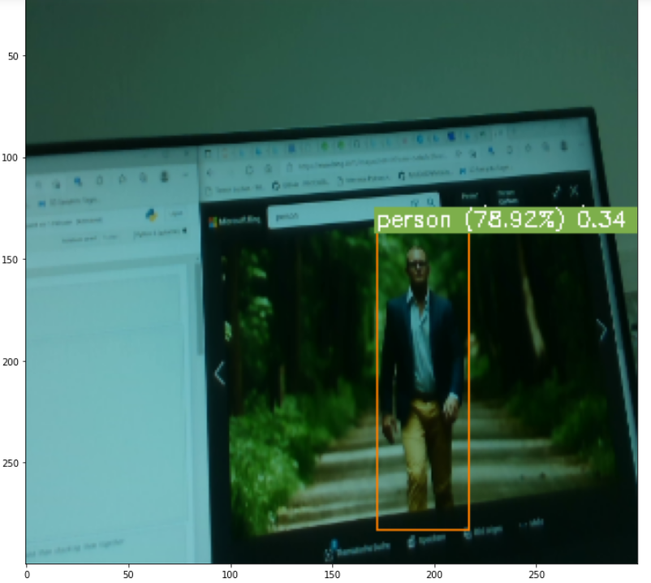
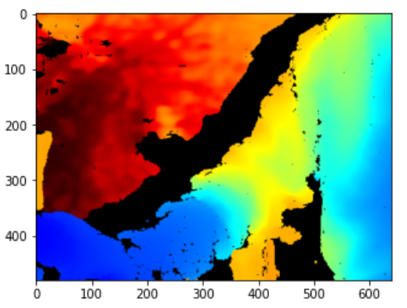
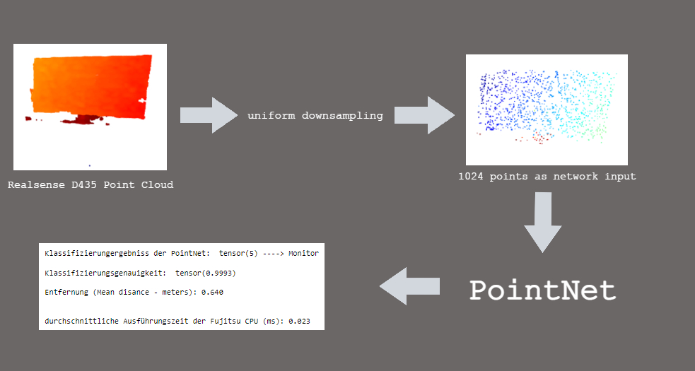
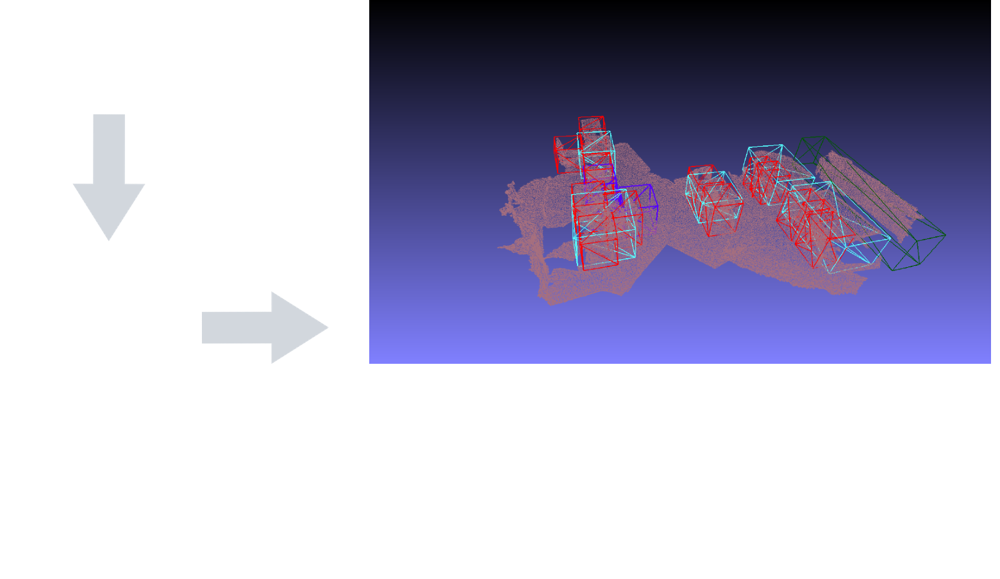
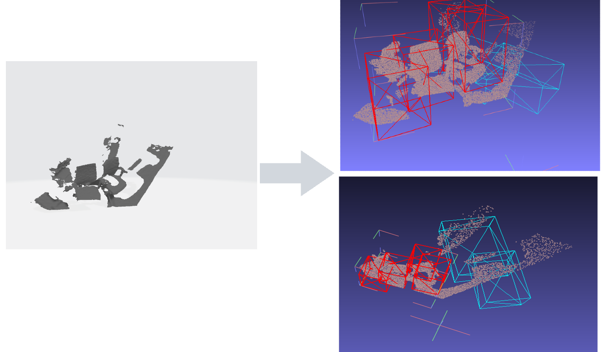
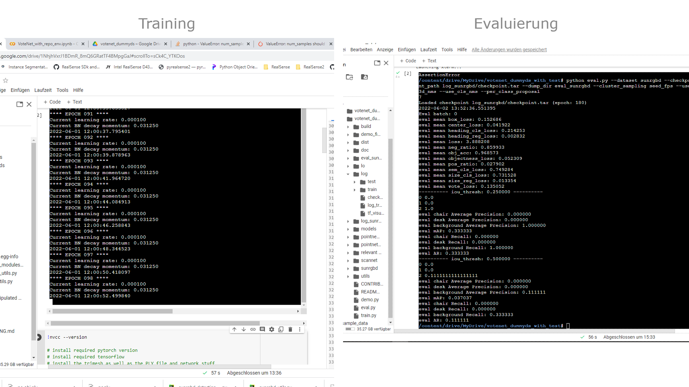
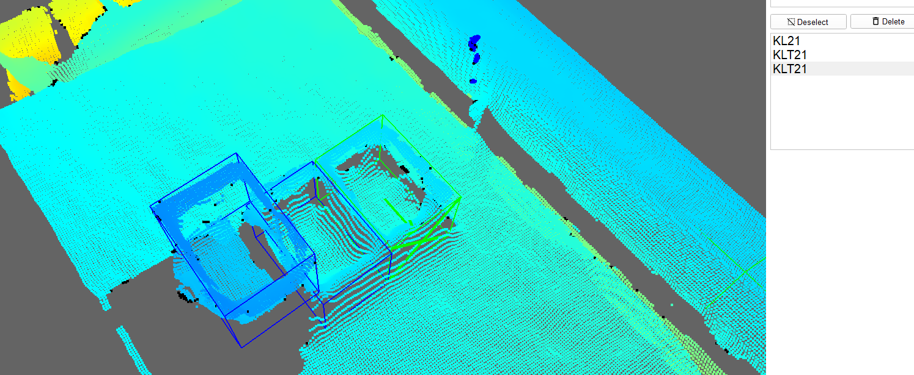

# realsense_python_ergeb
showcase updates

## Inhalt
* [MobileNetSSD](#trainierte-MobileNetSSD-+-Realsense-D400)
* [PoitNet Preparation](#Camera-depth-colormap-+-pointcloud-of-the-depth-colormap)
* [PoitNet Classification](#PointNet-Classification)
* [VoteNet Inference (SUN RGBD + eigine PointCloud)](#VoteNet-Inference-(SUN-RGBD-+-eigine-PointCloud))
* [Update 02.06.2022](#Update-02.06.2022)
* [Labeling-Datenaufbereitung](#Labeling-Datenaufbereitung)
* [Update 19.07.2022](#Update-19.07.2022)

## trainierte MobileNetSSD + Realsense D400

* Ergebnisse von der trainierte MobileNetSSD mit der Tiefe separat gerechnet von den Kamera
* Tiefdaten und Klassifizierung sind in einem OpenCV Label combiniert

          
      

## Camera depth colormap + pointcloud der depth colormap

* Kamera Tiefenkarte

     

## PointNet Classification

   

## VoteNet Inference (SUN RGBD + eigine PointCloud)

* SUN RGB-D PC

   
   
* eigine PC

   
   
* # Problem?
die Daten von die eigine PC würden manuell durch Meshlab ausgerichtet um den 3D bounding box zu entsprechen, da in der SUN RGB-D Datensatz, mussen erst rigid body transformationen als Vorbereitung für VoteNet durchgeführt werden. D. h., die Daten können auch möglicherweise in eine bestimmte Art sein müssen, bevor die Inferenz durchgeführt würde; welche in die eigine PC nicht der Fall ist.

## Update 02.06.2022

* Das Netzwerk ist jetzt für den Dummy Datensatz angepasst. Das heißt, dass man einen Datensatz mit der Interl Realsense RGBD Kamera PointClouds als daten erzeugen kann und die Annotation Tool "3d-on-3d.annotate" dafür, um die Labels zu generieren, zu nutzen, -> damit die dazugehörigen Bounding Boxes (Ground Truth).
* Der genutzte Datensatz besteht aus:
     * 15 PointClouds, i.e. 15 Szenen, indiziert von 0-7: Testing und von 7-15: Training
     * 3 Klassen: Desk, Chair und Background 
* Ein Trainings Forward Pass wurde erfolgreich durchgeführt 
* Ein Evaluierungs Forward Pass wurde auch erfolgreich durchgeführt 
* Trainierung und Evaluierung wurden in der Cloud durchgeführt und dort wurde auch die Environment und Laufzeittyp dafür bestätigt 
* 

## Labeling-Datenaufbereitung
* Statt transformieren von "3d-on-3d.annotate" annotierte Daten, ein neues Labeling Tool wurde benutzt (LabelCloud)
* Das VoteNet Code wurde dafür angepasst bzw. ein Forward Pass bestätigt (anders als 3d-on-3d.annotate, LabelCloud bearbeitet die Daten im Kamera Koordinatenframe bzw. keine weitere geometrische bearbeitung is notwendig) 
* soweit: ca. 90 PCs wurden gemacht und 70 davon glabelt
* Trainierung mit total 150-180 PCs vorgesehen. 
*  
   
## Update 19.07.2022

### Local
* Keine CUDA layer Kompilierung war möglich, zwar mit der "cl" Visual Studio Std. Windows Compiler, versions VS 17, 19 waren erfolglos 
* Empfohlen war, dies mit der g++ Linux Compiler zu kompilieren, war durch WSL2 Linux kernel möglich
* Kompilierung von Pointnet2 war erfolgreich
* Nachdem alle Environment Variablen bestimmt waren, gab es ein Segmentation Error, der möglicherweise etwas mit der Speicherplatzverteilung zu tun hat

  Docker: 
  	+ follow https://anchormen.nl/blog/data-science-ai/guide-wsl2-configuration-gpu-support/
  	+ i.e. enable virtualization, restart, set WSL2 as the main version, install Ubuntu 18.04 Bionic
  	+ for Docker:
	
       		+ curl https://get.docker.com | sh 
       		+ run at once: 
		    distribution=$(. /etc/os-release;echo $ID$VERSION_ID)

		    curl -s -L https://nvidia.github.io/nvidia-docker/gpgkey | sudo apt-key add -

		    curl -s -L https://nvidia.github.io/nvidia-docker/$distribution/nvidia-docker.list | sudo tee /etc/apt/sources.list.d/nvidia-docker.list

		    curl -s -L https://nvidia.github.io/libnvidia-container/experimental/$distribution/libnvidia-container-experimental.list | sudo tee /etc/apt                    /sources.list.d/libnvidia-container-experimental.list

       + install nvidia toolkit sample: 
		    sudo apt update && sudo apt install -y nvidia-docker2
		    sudo usermod -a -G docker $USER
       + to start docker (no systemd in win, docker will need to be started manually via): 
       		    sudo service docker start 
       + ensure docker is runnung: sudo service docker status 
       + if the upcomming command throws a permission denied, run: sudo chmod 666 /var/run/docker.sock, then run it 
       + docker run --gpus all --env NVIDIA_DISABLE_REQUIRE=1 nvcr.io/nvidia/k8s/cuda-sample:nbody nbody -gpu -benchmark
       + ---> running this doesn't seem to work: docker run --gpus all nvcr.io/nvidia/k8s/cuda-sample:nbody nbody -gpu -benchmark
       + both of the above commands give similar outputs, particularly, GPU info, they start a sample image with gpus enabled which can then be                        containarized
       + to initialize a container with cuda 10.1 and an ubuntu18.04 container: 
	    + docker run -it --gpus all nvidia/cuda:10.1-base-ubuntu18.04 nvidia-smi
	    + to run the container (already pulled with a bash cmd): docker run -i -t 0b82600f7a6b /bin/bash
       + Full command mounting the anaconda .sh installation file as well as the code folder (P.S. copy files 
       from the mnt/ in Ubuntu/wsl2 to somewhere with no path spaces, they are troublesome, i.e. to media or sth, then mount then from 
       there to the docker container, also do not forget to expose the driver, i.e. be able to use the nvidia-smi through the flag --gpus all):
	    docker run -it \
		      --name veeenn  \
		      --mount type=bind,source=/media/votenet_code,target=/home/ \
		      --mount type=bind,source=/media,target=/mnt/ \
		      --gpus all \
		      0b82600f7a6b /bin/bash

       + Now we have the targeted cuda toolkit 10.1 in usr/local/, anaconda .sh folder and the main code
       + ran the .sh file successfully and installed conda, restarted the container via: 
       		+ start docker normally as aforementioned
                + docker start <container-name/ID>, then
                + docker exec -it <container-name/ID> bin/bash

### Cloud
* Insgesamt wurden 156 Punktwolken erzeugt und annotiert
* Training für den Datensatz bis zu 180 epocht war erfolgreich, ohne Errors
* mit Subsampled Punkwolken auf 20,000 Punkte, 180 epochs, Batch Size 8 für epoch 52 sowie epoch 118:
* learning rate: ist 0.001 am anfang und sinkt allmählich bis 0.000001
* der Netzwerk ist bis zu 1000 epocht traniert, mit einem Batchnummer von 8 

<figure>
  <figcaption>box loss</figcaption>
  
 </figure>
 <figure>
  <figcaption>center loss</figcaption>
  
 </figure>

       

 <figure>
  <figcaption>heading class loss</figcaption>
  
 </figure>
 <figure>
  <figcaption>vote loss</figcaption>
  
 </figure>

 <figure>
  <figcaption>obj accuracy</figcaption>
  
 </figure>
 <figure>
  <figcaption>mean loss</figcaption>
  
 </figure>

### Trainingsrunden Zusammenfassung
| # Epochs  | subsampled points | batch | accuracy  | box loss | mean loss | vote loss |
| ------------- | ------------- | ------------- | ------------- | ------------- | ------------- |------------- | 
| 180  | 20000  | 10  | 0.997882  | 0.165145  | 3.764862  | 0.149045  |
| 1000  | 35000  |  8 | 0.997606  | 0.163451  | 3.843967  | 0.150954  | 

### Notizen
+ Der Netzwerk hat schlechte Detektion gezeigt, und overfitted Klasse 1, da mehr Labels davon im Vergleich im Datensatz sind.
+ Recall ist für alle Klassen auch nicht besonders gut
+ TO DOs:
	+ Mehr daten erzeugen, bzw. die Daten mehr repräsentative machen, mind. 3500 Punktwoklen insgesamt (im Vergleich Kitti ist ca. 7400+ und SUNrgbd ist 30000+)
	+ Wahrscheinlich ein Problem ist, dass die Features zwischen die verschiedene Klassen sehr ähnlich sind
	deswegen werden viel Daten benötigt
	+ aus dem Datensatz heraus erweitern, Augmentation ist schon random.
	+ Hintergründ enfernen, mit z > thresh

+ Hintergrund wurde entfernt, wichtige Objekte bleiben intakt
+ Wiederevaluierung der von der Datensatzklasse geschmißene PCs und Labels
+ Da die zur Erzeugung Daten größ sind und damit viel Zeit verschwindet wird (ein PC zu machen + zu labeln braucht ca. 3 Min. im Durchschnitt, insgesamt 175 Stunden, d.h. gegen 25 Tagen mit 7 Stunden / Tag, hängt auch davon ab, wie schnell mit der neuen Daten der Netzwerk sich verbessert), ertmal wird aus dem Datensatz heraus erweitert, sodass die Klassenverteilung is so viel wie möglich fair ist, dann werden mehr PCs gemacht -- ich vermute erstmal mit +200 den Netzwerk testen, danach die Erweiterungsmöglichkeit berücksichtigen.
+ mit boxnet für ungefähr 600 epoch trainieren

### notes on votenet and boxnet; 
+ the catagories that don't perform well are maily discontinous targets and spatially incomplete targets (source: https://blog.csdn.net/weixin_44330777/article/details/121231464 -- bottom of the article). This explains the shorcummings of this method on this particular dataset, a better more dense and complete pointcloud would be a possibility. The quality of the labels should also be improved, specially regarding complete items with dense and continuous points, which the 3D bounding box should engulf
