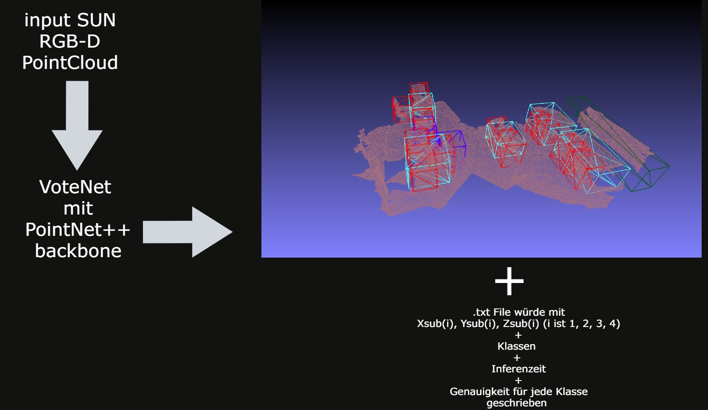

# realsense_python_ergeb
showcase updates

## Inhalt
* [MobileNetSSD](#trainierte-MobileNetSSD-+-Realsense-D400)
* [PoitNet Preparation](#Camera-depth-colormap-+-pointcloud-of-the-depth-colormap)
* [PoitNet Classification](#PointNet-Classification)
* [PoitNet Classification](#VoteNet-Inference-(SUN-RGB-D-+-eigine-PointCloud)

## trainierte MobileNetSSD + Realsense D400
* Ergebnisse von der trainierte MobileNetSSD mit der Tiefe separat gerechnet von den Kamera
* Tiefdaten und Klassifizierung sind in einem OpenCV Label combiniert

          
      

## Camera depth colormap + pointcloud der depth colormap
* Kamera Tiefenkarte

     

## PointNet Classification

   

## VoteNet Inference (SUN RGB-D + eigine PointCloud)
* SUN RGB-D PC

   
   
* eigine PC

   
   
* # Problem?
die Daten von die eigine PC würden manuell durch Meshlab ausgerichtet um den 3D bounding box zu entsprechen, da in der SUN RGB-D Datensatz, mussen erst rigid body transformationen als Vorbereitung für VoteNet durchgeführt werden. D. h., die Daten können auch möglicherweise in eine bestimmte Art sein müssen, bevor die Inferenz durchgeführt würde; welche in die eigine PC nicht der Fall ist.
   
