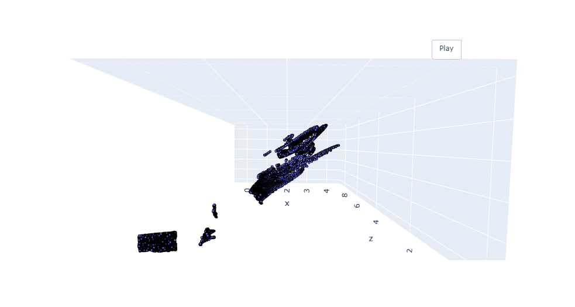

# realsense_python_ergeb
showcase updates

## Inhalt
* [MobileNetSSD](#trainierte-MobileNetSSD-+-Realsense-D400)
* [PoitNet Preparation](#Camera-depth-colormap-+-pointcloud-of-the-depth-colormap)
* [PoitNet Classification](#PointNet-Classification)

## trainierte MobileNetSSD + Realsense D400
* Ergebnisse von der trainierte MobileNetSSD mit der Tiefe separat gerechnet von den Kamera
* Tiefdaten und Klassifizierung sind in einem OpenCV Label combiniert

          
      

## Camera depth colormap + pointcloud der depth colormap
* Kamera Tiefenkarte

     

* PointCloud, die den depth_colormap entspricht
     

*   

## PointNet Classification

